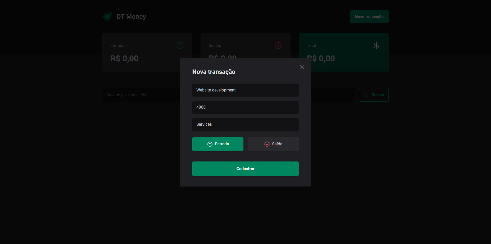
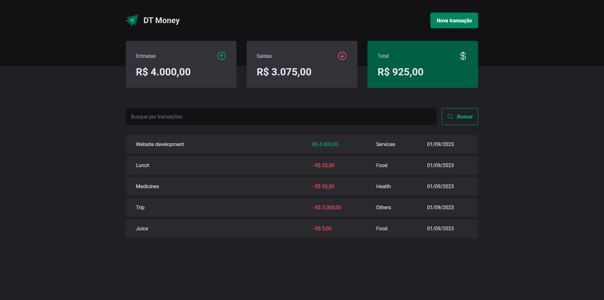
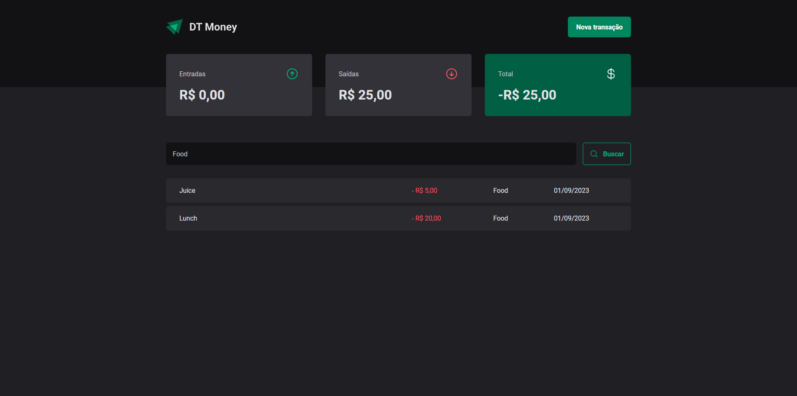

<h1 align = "center">DT Money</h1>
<p>💰 A digital wallet to help you take control of your finances.</p>


<h4 align="center"> 
	💰 DT Money 🚀 Done ✔️
</h4>

## Features

- Add new transaction
- Search for a transaction

## Requirements to run the project

<p>Before you run the project, check if you have [Node.js](https://nodejs.org/en/) installed on your machine, as well [Git](https://git-scm.com) to clone this repository.</p>

## Running the application

```bash
    # Clone this repository on your machine:
    $ git clone https://github.com/vitorlinsbinski/dt-money.git

    # Access the project folder in your terminal:
    $ cd dt-money

    # Install all dependencies:
    $ npm install

    # Initialize JSON Server with these parameters: -w for watching each HTTP request and -d for the delay in microseconds:
    $ npx json-server server.json -w -d 350

    # Run the application:
    $ npm run dev
```

## Main Technologies

- [ReactJS](https://react.dev/)
- [Vite](https://vitejs.dev/)
- [TypeScript](https://www.typescriptlang.org/)
- [React Hook Form](https://www.react-hook-form.com/)
- [ZOD](https://zod.dev/)
- [JSON Server](https://github.com/typicode/json-server)
- [Radix UI](https://www.radix-ui.com/)
- [Axios](https://axios-http.com/ptbr/docs/intro)
- [Phosphor React](https://github.com/phosphor-icons/react)
- [Styled Components](https://styled-components.com/)
- [use-context-selector](https://github.com/dai-shi/use-context-selector)

## Final Result





### Author

---

<a href="https://github.com/vitorlinsbinski">
 
 <br />
 <sub><b>Vitor Linsbinski</b></sub></a> <a href="https://github.com/vitorlinsbinski" title="">🚀</a>

Developed by Vitor Linsbinski

[](https://www.linkedin.com/in/vitorlinsbinski/)
